# Grupo P&H Engineering – Sitio corporativo (copia estática)

Archivo estático del sitio [grupopyh.com](https://grupopyh.com/), en el que participé durante mis prácticas.

## Páginas incluidas
| Página | Ruta |
|---|---|
| Inicio | `index.html` |
| Nosotros | `nosotros/` |
| Equipamiento Industrial | `equipamiento-industrial/` |
| Calderas PyH | `calderaspyh/` |
| Explotación Petrolera | `explotacion-petrolera-ph/` |
| Fertilizantes PyH | `fertilizantes-pyh/` |
| Clientes | `clientes/` |
| Contacto | `contacto/` |

## Capturas

Capturas tomadas de la copia local (escritorio 1440×900, móvil 390×844).

| Página | Escritorio | Móvil |
|---|---|---|
| **Inicio** | 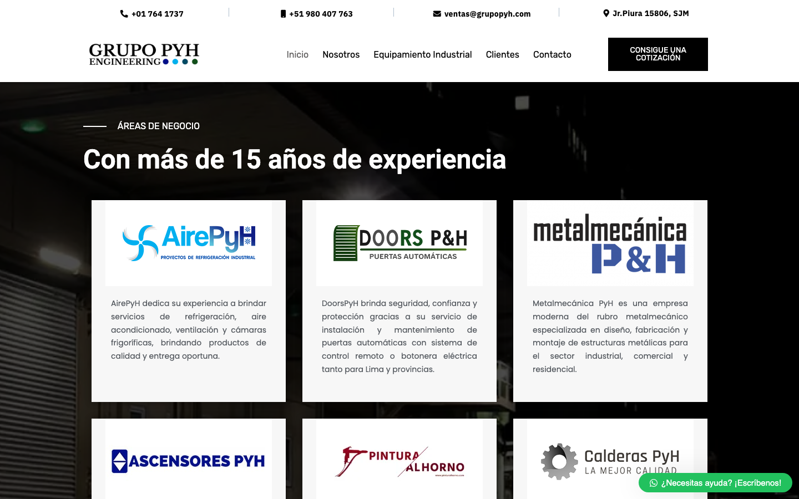 | 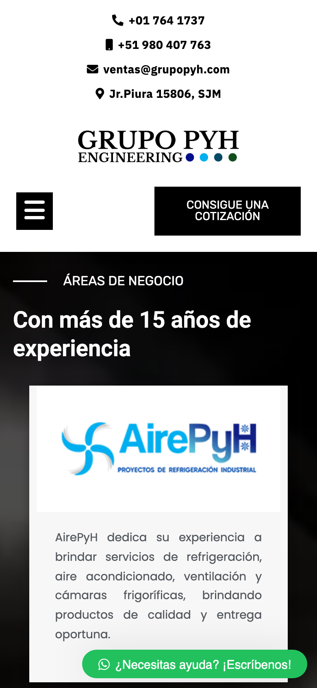 |
| **Nosotros** | 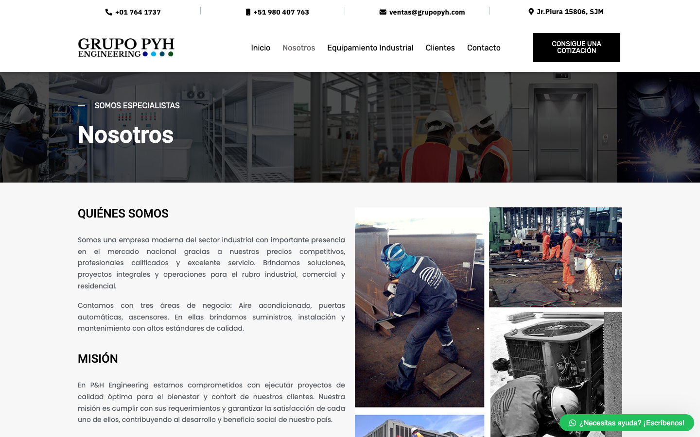 | 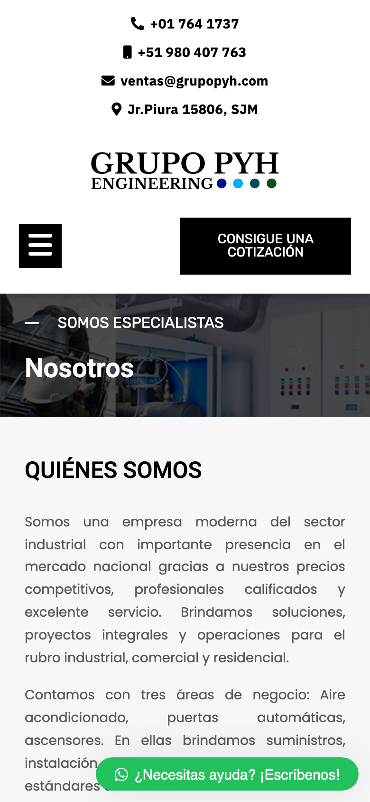 |
| **Equipamiento Industrial** | 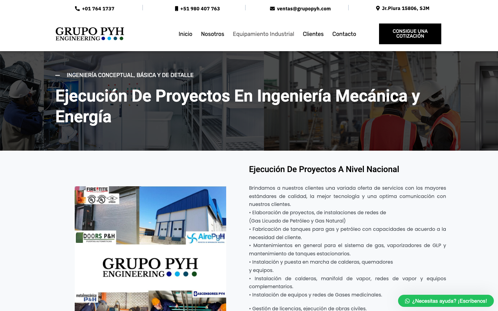 | 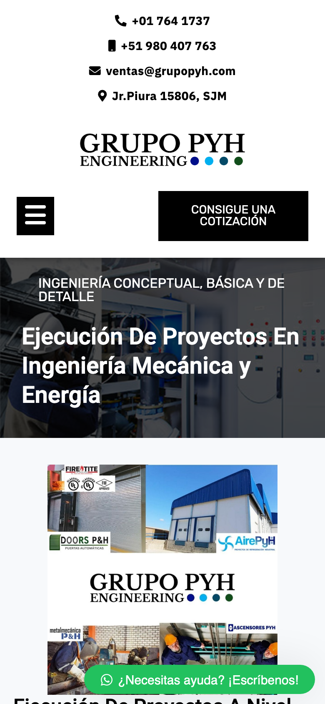 |
| **Calderas PyH** | 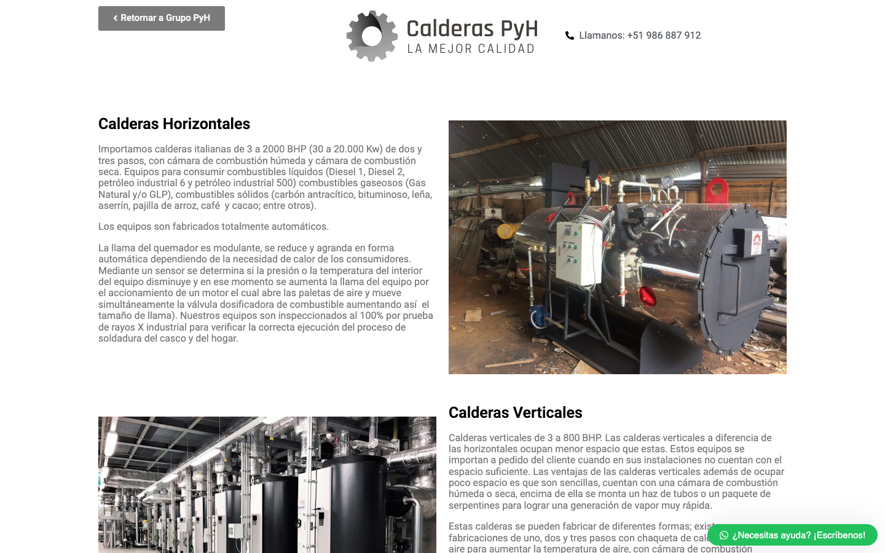 | 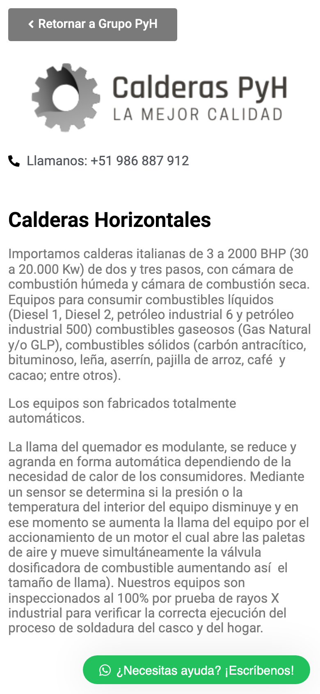 |
| **Explotación Petrolera** | 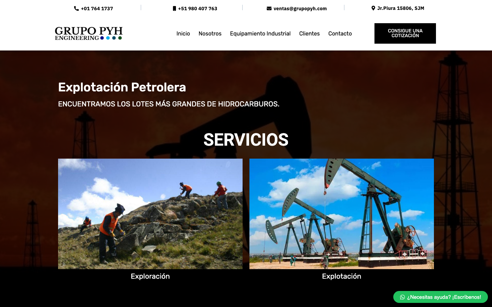 | 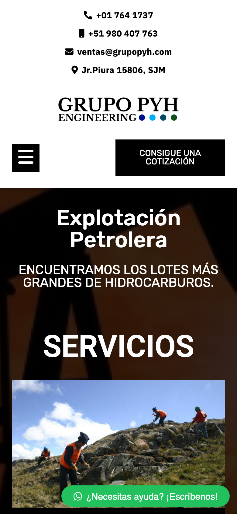 |
| **Fertilizantes PyH** | 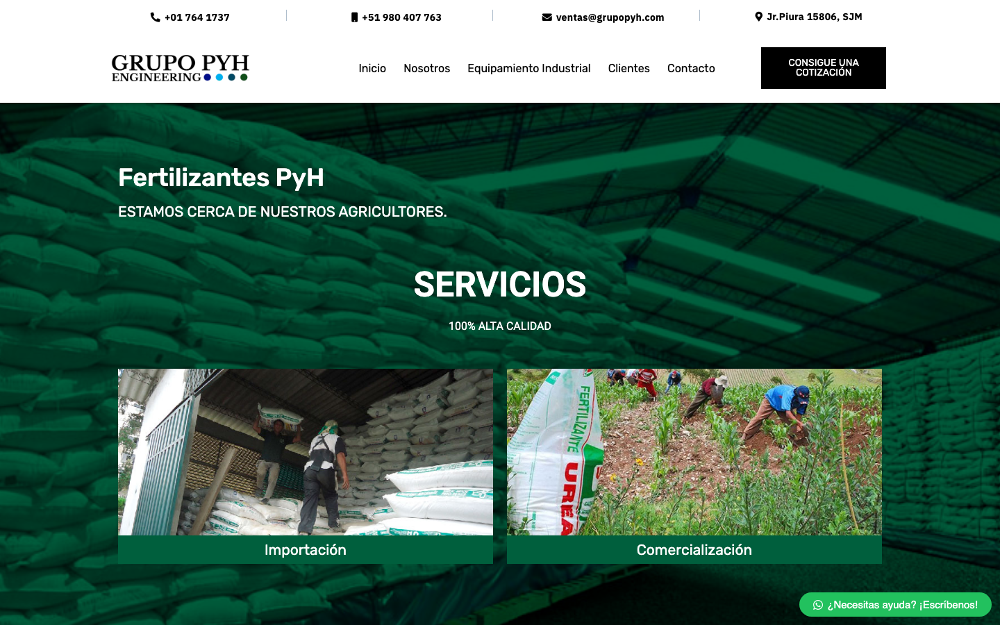 | 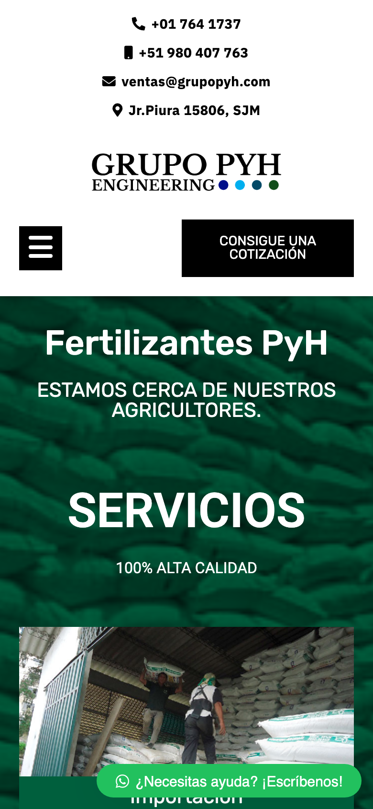 |
| **Clientes** | 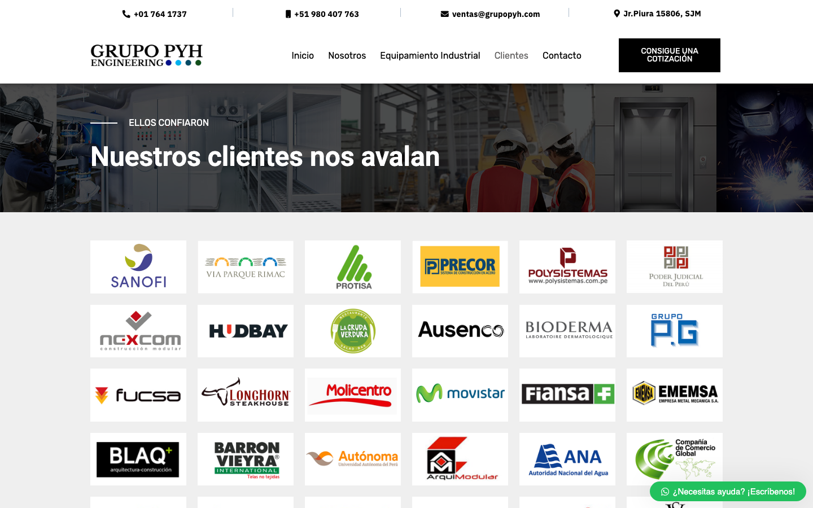 |  |
| **Contacto** | 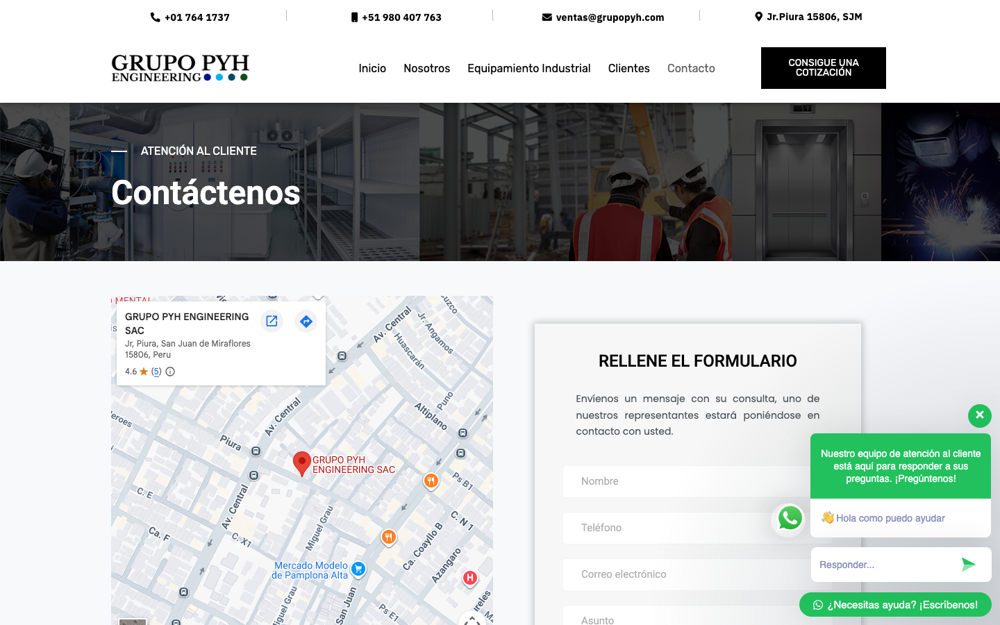 | 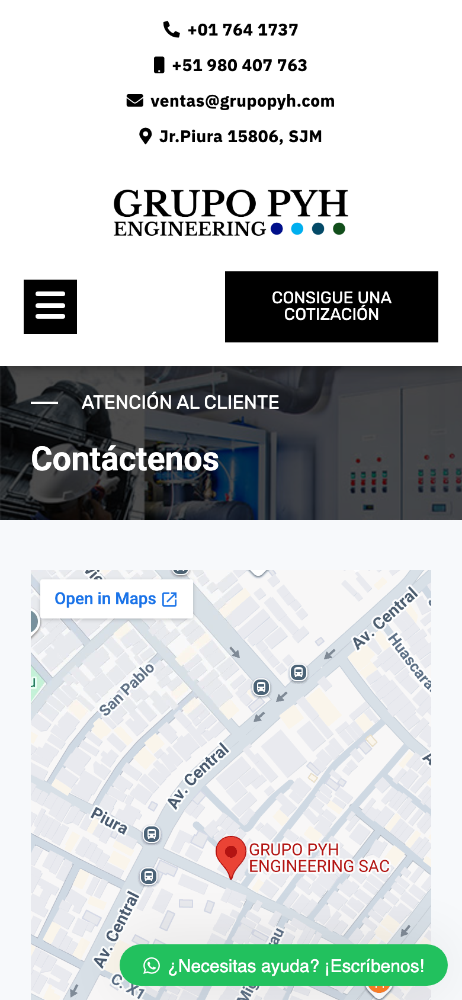 |

## Mi rol
**Practicante Asistente de TI — Grupo P&H Engineering S.A.C.** (agosto – diciembre 2023)

- Migré sitios web corporativos a plataformas de e-commerce.
- Optimicé la funcionalidad de servidores empresariales, lo que mejoró la disponibilidad de los sistemas.

## Stack del sitio original
WordPress + tema Jupiter X + Elementor (JetElements / JetTabs / JetTricks).

📐 Detalle de la arquitectura, las tecnologías y cómo se generó la copia: [docs/ARQUITECTURA.md](docs/ARQUITECTURA.md)

## Cómo verlo localmente
```bash
python3 -m http.server 8000
# abrir http://localhost:8000
```

## Aviso
Esta es una instantánea capturada en octubre de 2026 desde el sitio público y se usa solo como muestra de portafolio.
Todo el contenido, las marcas, los logotipos y las imágenes pertenecen a **Grupo P&H Engineering S.A.C.**
El backend (WordPress, base de datos, panel) no está incluido; solo hay HTML, CSS, JS y recursos estáticos.
